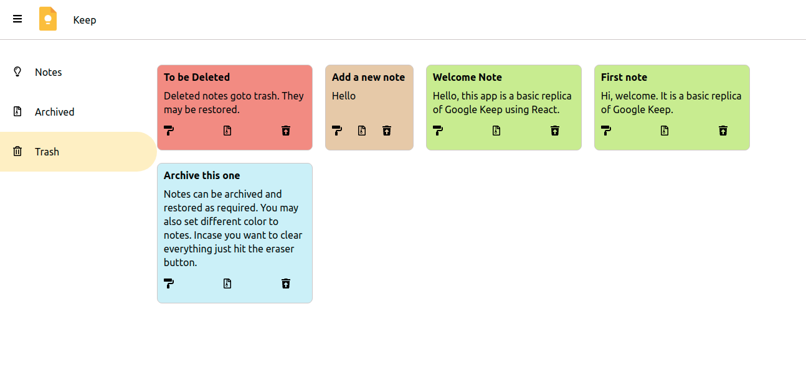

# A basic clone of Google Keep using React

This project has implemented Google Keep functionality using React. Apart from the basic react concepts the project involves code comprising of -

- Hooks
    - useState
    - useEffect
    - useContext
- Custom Hooks
    - for retrieving data from firebase
- Context
    - to avoid prop drilling
- Firebase
    - Retrieving data
    - Saving data 

## Demo

- #### Adding a new note


- #### Options for your note. You may color, save or clear the contents using the buttons.


- #### New note added


- #### Edit your note. The options allow to change color, archive or trash already existing notes.


- #### Archived notes can be restored using the restore option.


- #### Trashed notes can be removed from the bin.



## Contribute

Feel free to contribute to the project. The objective while doing this project was to explore concepts of react. Therefore, things like accessibility and styling need improvement.

While setting up please add your own `firebase.js` file directly under `src` folder with the following contents.

```js
import firebase from 'firebase/app';
import 'firebase/firestore';

const firebaseConfig = firebase.initializeApp({
    apiKey: #youApiKey,
    projectId: #yourProjectId
  });

export { firebaseConfig as firebase };
```

This project uses a `collection` named as `notes` from firebase.
